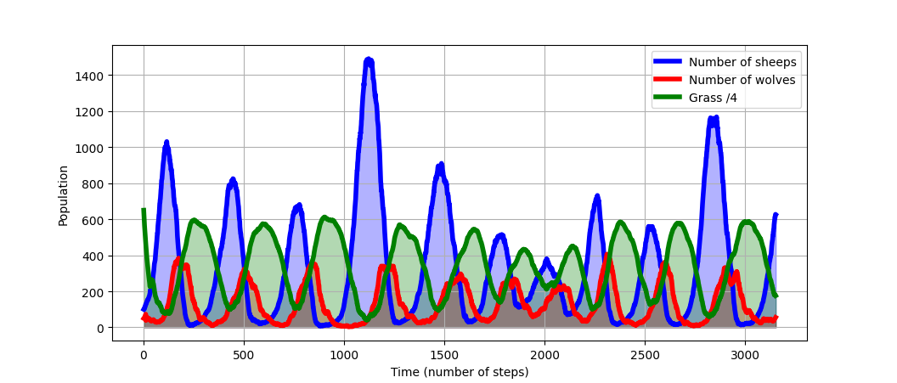

# Documentation of the code

## Grass-sheeps-wolves predation model

The model is taken from this article available on [this webpage](http://ccl.northwestern.edu/papers/wolfsheep.pdf )  :

- Wilensky, U. & Reisman, K. (2006). Thinking like a Wolf, a Sheep or a Firefly: Learning Biology through Constructing and Testing Computational Theories -- an Embodied Modeling Approach. Cognition & Instruction, 24(2), pp. 171-209.

There are three kinds of agents: the sheeps, the wolves and the grass. The code implements the rule-set S2 for the sheeps, the rule-set W2 for the wolves and the rule-set P1 for the grass. In this model, the agents are put on a toroidal grid. At the initial steps, each case of the grid contains a patch of grass. The wolves and sheeps are placed randomly. The parameters *init_nb_sheeps* and *init_nb_wolves* are the numbers of sheeps and wolves at this step. 

This is the behaviour of the sheeps at each time step:

1. A sheep moves randomly to an adjacent case on the grid and loses some amount of energy controlled by the parameter *move_loss*.
   
2. If there is grass on the patch where a sheep is, the sheep eats and its energy increases by some amount controlled by the parameter *sheep_gain_from_grass*.
   
3. When the energy of a sheep becomes negative, it dies.
   
4. A sheep also has a certain probability to reproduce. This is the parameter *sheep_reproduction_rate* in the code. A sheep also dies when it is eaten by a wolf.

What the wolves do at each time step is:

1. Moving randomly to adjacent patches like the sheeps. They also lose energy when they do. The prarameter *wolf_move_loss* controls this loss.
   
2. Eating sheeps, if there are some on the patch on which they are. When they eat, their energy increases by an amount given by *wolf_gain_from_sheep*. Eaten sheeps die and are removed from the grid.
   
3. Reproducing with a certain probability given by the parameter *wolf _reproduction_rate*.
   
4. Dying when their energy is negative.  

The behaviour of the patches at each time step is given by this rule-set:

1. If green, do nothing.
2. If not green, then wait *grass_regrowth_time* time steps and become green again.

These rule-sets and the right parameters values can lead to these kind of simulation results where we see stable oscillations of the populations.

## Extension of the model in adding a disease

Our code also implements a variant of the previous model in adding a disease among the sheeps:

- the disease infects only the sheeps
- when an infected sheep is located on the same patch as a healthy one, it has a certiain chance to infect him.

## Usage of the GUI

The graphical interface is divided into two panels: 

- The left one has sliders to set the values of the model parameters and buttons to control the running of the prey-predator simulation. The button `Set up` takes into account the values set by the sliders, the button `Run` allows to start the simulation and `Stop` stops it.

- The right one is occupied by two plots. On the upper part, the GUI displays the occupants of the grid at the current time step. On the bottom part, a second plot shows the evolution of the population of wolves, sheeps and grass over time. 